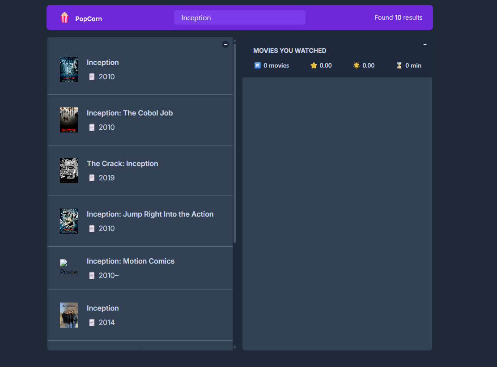

# 🎬 Movie Tracker

A simple and elegant React app that helps you **track the movies you've watched**, see their **IMDb ratings**, and add your own **personal ratings**. Perfect for movie lovers who want to keep their movie journey organized and rated!

## ✨ Features

- 🔍 Search for movies by name
- 📄 View detailed information fetched from the OMDb API
- ✅ Mark movies as watched
- ⭐ Rate movies with your own personal score
- 📊 See statistics like average IMDb rating, your average rating, and total watch time
- ❌ Remove movies from your watched list
- 💾 Persistent local storage — your list is saved even when you close the browser
- 🔄 Loading spinners and smooth animations for better UX

## 🖥️ Demo

> You can clone the project and run it locally:

```bash
git clone https://github.com/georgegeham/PopCorn
cd PopCorn
npm install
npm start
```

## 🛠️ Technologies Used

- **React** (with Hooks)
- **TypeScript**
- **Tailwind CSS** for UI styling
- **OMDb API** for movie data: [http://www.omdbapi.com](http://www.omdbapi.com)
- **LocalStorage** for saving the watched list

## 📁 Folder Structure

```
src/
├── components/
│ ├── MovieCard.tsx
│ ├── Detail.tsx
│ ├── Navbar.tsx
│ ├── Main.tsx
│ └── Statistics.tsx
├── Movies.ts # Movie model / types
├── API.ts # Movie fetching logic
├── App.tsx
└── index.tsx
```

## 🔑 Environment Variables

To use the OMDb API, you’ll need an API key.

1. Create a `.env` file in the root
2. Add this line:

## 📷 Screenshots



## 📄 License

This project is open-source and available under the [MIT License](./LICENSE).

---

**Built with ❤️ by [George Geham]**
